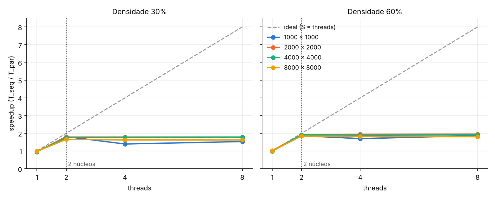

# floodfill - conectividade 8 - T1

Trabalho prático de Sistemas Operacionais (PUCRS, Escola Politécnica, 2026/II), Prof. Filipo Mór.

**Autoria:** Caio Madeira, João SPerb e Victor.

O programa conta os **objetos** de uma matriz binária: grupos de células com valor 1 ligadas por um lado ou por um canto (**conectividade 8**). Há duas versões que dão sempre o mesmo resultado:

- `src/conta-obj-sequencial.c`: um único fluxo de execução. É a referência de correção e de tempo.
- `src/conta-obj-paralelo.c`: versão paralela com **Pthreads**, com número de threads configurável.

Tudo em ANSI C (C89), compilando sem avisos com `-std=c89 -Wall -Wextra -pedantic`, em Linux e macOS.

---

## 1. Estrutura do repositório

```
t1/
├── Makefile
├── README.md                     este relatório
├── src/
│   ├── conta-obj-sequencial.c
│   └── conta-obj-paralelo.c
├── tests/
│   ├── caso5_5.txt ... caso12_12.txt   as 5 matrizes obrigatórias do enunciado
│   └── gera-matriz.c                   gerador de matrizes grandes (semente fixa)
├── scripts/
│   ├── testes.sh          testes de correção (make test)
│   ├── experimentos.sh    medições de desempenho (make experimentos)
│   └── analisa.py         mediana, speedup, tabela e gráfico
├── results/
│   ├── tempos.csv         todas as medições (650 execuções)
│   ├── resumo.md          tabelas com a mediana e o speedup
│   ├── speedup.png        gráfico de speedup
│   └── maquina.txt        máquina e compilador usados
└── slides/
    └── apresentacao.pdf
```

## 2. Compilação

```sh
cd t1
make            # gera ./sequencial, ./paralelo e ./gera-matriz
make clean      # apaga os executáveis
```

O `Makefile` usa `cc -std=c89 -Wall -Wextra -pedantic -O2` (e `-pthread` no paralelo). Os dois fontes definem `_POSIX_C_SOURCE 200112L` para que `clock_gettime()` continue disponível mesmo em modo C89 estrito.

## 3. Execução

```sh
./sequencial tests/caso8_8.txt
./paralelo   tests/caso8_8.txt 2      # 2º argumento = número de threads (padrão: 4)
```

Formato do arquivo de entrada: a primeira linha tem `LINHAS COLUNAS`; depois vem a matriz, com valores 0 ou 1 separados por espaço.

```
8 8
1 1 0 0 0 0 0 0
1 0 0 0 0 0 0 0
...
```

Saída do paralelo no Exemplo 3 com 2 threads (a matriz só é impressa quando tem até 30 × 30):

```
thread 0: linhas [0, 4) -> 3 objetos locais
thread 1: linhas [4, 8) -> 3 objetos locais
soma local: 6 | unioes na fronteira: 1

obj count: 5
tempo: 160.5 us (threads: 159.7 us | consolidacao: 0.8 us)
```

Se forem pedidas mais threads do que linhas, o programa avisa e usa uma thread por linha.

Para gerar uma matriz grande: `./gera-matriz LINHAS COLUNAS DENSIDADE_% SEMENTE > arquivo.txt` (ex.: `./gera-matriz 4000 4000 60 42 > grande.txt`). O gerador usa um gerador congruente linear próprio, então a mesma semente gera a mesma matriz no Linux e no macOS.

---

## 4. Arquitetura

### 4.1 Versão sequencial

`countObjects()` percorre a matriz linha a linha. Ao achar uma célula 1 ainda não visitada, encontrou um objeto novo: incrementa o contador e chama `floodFill()`, que marca em `visited` todas as células daquele objeto. Os 8 vizinhos de uma célula são os deslocamentos dos vetores `direction_x` / `direction_y`.

O **flood fill é iterativo**, com uma pilha explícita alocada com `malloc` (`pilha`), e não recursivo. Cada célula é guardada como um único inteiro (`linha * COL + coluna`) e é marcada como visitada no momento em que entra na pilha, então entra no máximo uma vez; a pilha nunca passa de `LINHAS × COLUNAS` posições. Motivo (requisito 41): a versão recursiva original terminava com *segmentation fault* numa matriz 2000 × 2000 com 60% de células 1, porque um objeto gigante gera milhões de chamadas aninhadas e estoura a pilha do processo.

### 4.2 Versão paralela: decomposição em faixas de linhas

A matriz é dividida em **faixas horizontais contíguas**, uma por thread. A thread `t` (de `T` threads) recebe as linhas

```
[ t·L/T , (t+1)·L/T )        L = número de linhas
```

Exemplo 3 (8 × 8) com 2 threads:

```
            col: 0 1 2 3 4 5 6 7
thread 0    0    1 1 . . . . . .
            1    1 . . . . . . .
            2    . . . . . . 1 .
            3    . . . 1 1 . 1 .
            ---------------------   fronteira
thread 1    4    . . . 1 1 . . .
            5    . . . . . . . .
            6    . . 1 . . . . 1
            7    . . 1 . . . 1 1
```

Por que faixas de linhas:

- cada linha fica inteira com uma thread, então só existem fronteiras **horizontais** e a consolidação só precisa comparar pares de linhas vizinhas;
- as faixas são contíguas na memória (cada thread varre as suas linhas inteiras), o que é bom para o cache;
- com 2 threads nos exemplos 1 a 3 e 3 threads nos exemplos 4 e 5, as fronteiras caem **exatamente** nas linhas laranja horizontais das grades ilustrativas do enunciado. As linhas verticais não existem nesta decomposição.

### 4.3 Fase paralela: rotulagem local

Cada thread executa `trabalho()` → `countObjects(matrix, inicio, fim)`, que faz o mesmo flood fill do sequencial, mas restrito às linhas `[inicio, fim)` da sua faixa, e com uma pilha própria. Em vez de marcar `visited` com 1, a thread grava um **rótulo**:

```
rótulo = linha_semente × COL + coluna_semente + 1
```

ou seja, a posição da célula onde o objeto começou, mais 1 (para que 0 continue significando “não visitada”). Esse número já é **único na matriz inteira** sem nenhum contador compartilhado, então as threads não precisam combinar nada entre si para escolher rótulos. No Exemplo 3, a thread 0 encontra os objetos 1, 23 e 28 e a thread 1 encontra 36, 51 e 56. O objeto 28 e o 36 são o mesmo objeto, cortado pela fronteira: somar dá 6, e a resposta certa é 5.

### 4.4 Fase sequencial: consolidação com union-find

Depois do `pthread_join` de todas as threads, a thread principal:

1. Para cada fronteira entre a faixa `k` e a faixa `k+1`, percorre a última linha da faixa `k` (`count_duplicates()`). Para cada célula rotulada, olha os **3 vizinhos de baixo**, na primeira linha da faixa `k+1`: diagonal esquerda (`d = -1`), vertical (`d = 0`) e diagonal direita (`d = +1`).
2. Para cada par de rótulos que se tocam, chama `unir(a, b)` no **union-find** (conjuntos disjuntos, vetor `pai`). `unir` retorna 1 só quando `a` e `b` ainda estavam em conjuntos diferentes.
3. O total de objetos é

```
objetos = Σ objetos locais − número de uniões
```

Cada união bem-sucedida significa que dois objetos locais eram, na verdade, o mesmo objeto global.

**Por que union-find e não só contar pares que se tocam?** Um mesmo par pode se tocar em vários pontos (no Exemplo 3, o 28 toca o 36 duas vezes), e um objeto de uma faixa pode juntar dois pedaços de outra (formato de U). Contar pares descontaria demais; o union-find só conta uniões entre conjuntos ainda separados, e trata naturalmente objetos que atravessam várias faixas (a ligação é transitiva).

Detalhes do union-find:

- `pai` é criado com `calloc`, e **`pai[r] == 0` significa que `r` é raiz**. Como os rótulos começam em 1, o zero nunca é rótulo válido. Assim o vetor não precisa de um laço sequencial de inicialização (`pai[k] = k` para cada célula), que custava ~35 ms numa matriz 4000 × 4000 (ver seção 6.4). O `calloc` de um bloco grande recebe páginas já zeradas do sistema operacional, e só as páginas realmente usadas pelos rótulos de fronteira chegam a ser tocadas.
- `find()` usa *path halving* (`pai[x] = pai[pai[x]]`), que encurta os caminhos da árvore a cada busca.

### 4.5 Fronteiras horizontais, verticais, diagonais e o “encontro de 4 blocos”

| Tipo de ligação | Onde é tratada |
|---|---|
| Horizontal (mesma linha) | Dentro do flood fill local: a linha inteira está na mesma faixa. |
| Vertical atravessando a fronteira | `count_duplicates`, vizinho `d = 0`. |
| Diagonal atravessando a fronteira | `count_duplicates`, vizinhos `d = -1` e `d = +1`. |
| Objeto que atravessa várias faixas | Transitividade do union-find. |

Numa decomposição em blocos 2D, o caso difícil é o ponto onde 4 blocos se encontram e dois objetos só se tocam pelo canto. Com faixas de linhas esse ponto não existe; o caso equivalente é o **toque só pelo canto através de uma fronteira horizontal**, coberto pelos vizinhos `d = ±1`. O Exemplo 5 com 3 threads mostra exatamente isso: a diagonal longa cruza as duas fronteiras só pelo canto, (3,3)–(4,4) e (7,7)–(8,8).

Consolidação nas 5 matrizes obrigatórias, com as mesmas divisões das grades do enunciado:

| Exemplo | Threads | Faixas (linhas) | Objetos locais por thread | Soma | Uniões | Resultado |
|---|---|---|---|---|---|---|
| 1 (5 × 5) | 2 | 0–1, 2–4 | 1, 2 | 3 | 0 | 3 |
| 2 (6 × 8) | 2 | 0–2, 3–5 | 2, 3 | 5 | 1 | 4 |
| 3 (8 × 8) | 2 | 0–3, 4–7 | 3, 3 | 6 | 1 | 5 |
| 4 (9 × 12) | 3 | 0–2, 3–5, 6–8 | 2, 3, 4 | 9 | 3 | 6 |
| 5 (12 × 12) | 3 | 0–3, 4–7, 8–11 | 3, 3, 4 | 10 | 3 | 7 |

### 4.6 Sincronização e ausência de condições de corrida

| Dado compartilhado | Quem escreve | Por que é seguro |
|---|---|---|
| `matrix` | ninguém (só leitura) | leituras simultâneas não conflitam |
| `visited` | a thread dona da faixa, na fase paralela | o flood fill só lê e escreve linhas `[inicio, fim)` da própria faixa |
| `dados_threads[t].contagem` | só a thread `t`, ao terminar | cada thread tem a sua posição |
| `pai[]`, `total_duplicates` | só a thread principal | usados apenas depois de todos os `pthread_join` |

O **`pthread_join` é o ponto de sincronização** (funciona como barreira): quando ele retorna, tudo o que a thread escreveu está visível para a thread principal. Como nenhuma posição de memória é escrita por duas threads, não há região crítica e **nenhum mutex é necessário**; por consequência não há risco de deadlock nem de atualização perdida. Um mutex aqui só serializaria trabalho sem proteger nada.

Verificações feitas:

- **ThreadSanitizer** (`gcc -fsanitize=thread`) com 2, 3 e 8 threads numa matriz 300 × 300: nenhum alerta.
- **Valgrind Helgrind** com 4 threads: 0 erros.
- **Valgrind Memcheck** nas duas versões: 0 erros e “All heap blocks were freed — no leaks are possible”.

### 4.7 O que é paralelo e o que é sequencial (requisito 33)

| Trecho | Execução | Custo | Justificativa |
|---|---|---|---|
| Leitura do arquivo | sequencial | O(L·C) | E/S de um único arquivo texto; fica fora da medição de tempo. |
| Flood fill / rotulagem | **paralelo** | O(L·C) | É praticamente todo o trabalho de contagem. |
| Criação e `join` das threads | sequencial | O(T) | Inevitável; dezenas de microssegundos. |
| Consolidação das fronteiras | sequencial | O(T·C) | Só (T − 1) pares de linhas: 0,5 ms com 2 threads e 3,4 ms com 8 threads em 8000 × 8000 (menos de 0,5% do tempo). |
| Soma das contagens | sequencial | O(T) | Desprezível. |

### 4.8 Tratamento de erros e qualidade

- Retornos verificados: `fopen`, `fscanf` (formato e quantidade de valores), `malloc`/`calloc`, `pthread_create` e `pthread_join` (código de erro mostrado com `strerror`), `clock_gettime`.
- Argumentos validados: número de threads ≥ 1; se for maior que o número de linhas, é limitado a uma thread por linha (toda thread recebe trabalho).
- Toda a memória (matriz, `visited`, pilhas, `pai`, vetores de threads) é liberada; conferido com Valgrind.
- Sem recursão (requisito 41).
- No `floodFill` sequencial, `ROW` e `COL` são copiados para variáveis locais. Como `visited` é escrito por ponteiro, o compilador não pode supor que as globais não mudaram e as relia da memória a cada vizinho; isso deixava o sequencial ~8% mais lento que o paralelo com 1 thread, o que inflaria o speedup. Com a cópia local, a base de comparação ficou justa.

---

## 5. Testes de correção

`make test` executa `scripts/testes.sh`:

1. as 5 matrizes obrigatórias no sequencial e no paralelo com 1, 2, 3 e 4 threads, comparando com o esperado do enunciado;
2. 200 matrizes aleatórias (20 a 80 linhas, 15 a 80 colunas, 20% a 70% de 1s), comparando o paralelo com 2, 3, 4 e 7 threads com o sequencial.

```
== Matrizes obrigatorias
caso       esperado  sequencial  paralelo (1,2,3,4)    status
caso5_5    3         3           3 3 3 3               OK
caso6_8    4         4           4 4 4 4               OK
caso8_8    5         5           5 5 5 5               OK
caso9_12   6         6           6 6 6 6               OK
caso12_12  7         7           7 7 7 7               OK

== Matrizes aleatorias (sequencial x paralelo)
800 comparacoes iguais ao sequencial

TODOS OS TESTES PASSARAM
```

### Registro dos resultados (tabela 7.1 do enunciado)

| Ex. | Dimensões | Esperado | Sequencial | Paralelo |
|---|---|---|---|---|
| 1 | 5 × 5 | 3 | 3 | 3 |
| 2 | 6 × 8 | 4 | 4 | 4 |
| 3 | 8 × 8 | 5 | 5 | 5 |
| 4 | 9 × 12 | 6 | 6 | 6 |
| 5 | 12 × 12 | 7 | 7 | 7 |

O paralelo deu o mesmo resultado com qualquer número de threads testado (1 a 4 no `make test`, e até uma thread por linha).

---

## 6. Análise de desempenho

### 6.1 Método

- **Máquina:** VM Linux com 2 núcleos (Intel Xeon 2,1 GHz), 7 GB de RAM, gcc 13.3 com `-O2` (detalhes em `results/maquina.txt`).
- **Matrizes:** as 5 obrigatórias e matrizes quadradas geradas por `gera-matriz` com semente 42: 1000², 2000², 4000² e 8000², com densidade de 30% (muitos objetos pequenos) e 60% (poucos objetos, alguns gigantes atravessando todas as faixas).
- **Threads:** 1, 2, 4 e 8.
- **Repetições:** cada configuração foi executada **10 vezes**, intercalando sequencial e paralelo em cada rodada para que variações da máquina afetem os dois igualmente. O valor representativo é a **mediana** das 10 execuções, que não é puxada por uma execução atrapalhada pelo sistema operacional. Todas as medições estão em `results/tempos.csv`.
- **O que entra no tempo:** só a contagem, medida com `clock_gettime(CLOCK_MONOTONIC)`. A leitura do arquivo e a impressão ficam de fora. No paralelo, o tempo inclui criar as threads, o `join` e a consolidação.
- **Aceleração:** `S = T_sequencial / T_paralelo` (medianas).

Para repetir em outra máquina: `make experimentos` (parâmetros podem ser trocados, ex.: `THREADS="1 2 4 8 16" REPETICOES=5 make experimentos`). O script regenera `results/` inteiro.

### 6.2 Resultados

Matrizes obrigatórias (tempo em microssegundos, mediana de 10):

| Matriz | Dimensões | Objetos | Sequencial | Paralelo 1T | Paralelo 2T | Paralelo 4T | Paralelo 8T |
|---|---|---|---|---|---|---|---|
| caso5_5 | 5 x 5 | 3 | 1.2 | 68.4 | 108.5 | 140.9 | 213.6 |
| caso6_8 | 6 x 8 | 4 | 2.5 | 71.3 | 87.0 | 130.1 | 292.9 |
| caso8_8 | 8 x 8 | 5 | 2.2 | 72.7 | 90.2 | 132.2 | 274.1 |
| caso9_12 | 9 x 12 | 6 | 3.2 | 72.1 | 87.4 | 156.4 | 283.2 |
| caso12_12 | 12 x 12 | 7 | 3.6 | 69.2 | 92.2 | 131.4 | 294.8 |



### 6.3 Discussão

- **Com 2 threads, o speedup ficou entre 1,66 e 1,92** nas matrizes grandes, perto do máximo de 2 que uma máquina de 2 núcleos permite.
- **Com 1 thread, S ficou entre 0,95 e 1,02.** O custo extra do paralelo (criar 1 thread, `join`, consolidação) é pequeno diante do trabalho nas matrizes grandes.
- **Com 4 e 8 threads não há ganho extra.** A máquina tem só 2 núcleos: as threads a mais se revezam nos mesmos núcleos e pagam trocas de contexto. Na 1000 × 1000 com 30%, o speedup caiu de 1,81 (2 threads) para 1,39 (4 threads). Numa máquina com mais núcleos, a tendência é o ganho continuar crescendo até o número de núcleos.
- **Densidade 60% escala um pouco melhor que 30%.** Com 60% há mais trabalho de flood fill por célula lida; com 30% o programa passa proporcionalmente mais tempo só percorrendo a matriz. O menor ganho (1,66, em 8000 × 8000 com 30%) provavelmente vem da memória: a matriz e o `visited` ocupam ~256 MB cada, muito acima do cache, e as duas threads disputam a mesma banda de memória.

### 6.4 Casos em que o paralelo é mais lento (requisito 38)

1. **Matrizes pequenas.** Nas 5 matrizes obrigatórias, o sequencial leva de 1 a 4 µs e o paralelo de 68 a 295 µs. Criar e esperar uma thread custa dezenas de microssegundos, mais que contar 144 células. Quanto mais threads, pior (8 threads levam 3 a 4 vezes o tempo de 1 thread).
2. **Mais threads do que núcleos**, como discutido acima.
3. **Parte sequencial (lei de Amdahl).** Na primeira versão, o vetor `pai` era inicializado com um laço sequencial (`pai[k] = k` para cada uma das L·C posições) depois do `join`. Na 4000 × 4000 com 30% isso levava ~31–38 ms de um total de ~215–240 ms com 2 threads (cerca de 15% do tempo, que não diminui com mais threads). Trocando por `calloc` com a convenção “0 = raiz”, a consolidação passou a levar menos de 1 ms e o tempo com 2 threads caiu para ~180 ms.

### 6.5 Limitações e melhorias possíveis

- **Balanceamento:** as faixas têm o mesmo número de linhas, o que é bom quando os objetos estão espalhados (como nas matrizes aleatórias). Numa matriz com todos os objetos numa metade, uma thread trabalharia mais. Uma fila dinâmica de faixas menores (mais faixas que threads, distribuídas sob demanda com um contador protegido por mutex) resolveria isso.
- **Memória:** `visited` e `pai` usam um `int` por célula. Para matrizes muito maiores, os rótulos poderiam ser renumerados por faixa para reduzir o `pai`.

---

## 7. Referências e ferramentas

- Enunciado do trabalho: *Contagem paralela de objetos em uma matriz binária*, Prof. Filipo Mór, PUCRS, 2026/II.
- A. Rosenfeld e J. L. Pfaltz. *Sequential Operations in Digital Picture Processing*. Journal of the ACM, 13(4), 1966 (rotulagem de componentes conexos).
- T. H. Cormen et al. *Introduction to Algorithms*, capítulo “Data Structures for Disjoint Sets” (union-find).
- G. M. Amdahl. *Validity of the single processor approach to achieving large scale computing capabilities*. AFIPS, 1967.
- Páginas de manual POSIX: `pthread_create(3)`, `pthread_join(3)`, `clock_gettime(2)`.
- Ferramentas: gcc e clang, ThreadSanitizer, Valgrind (Memcheck e Helgrind), Python 3 com matplotlib (só para o gráfico).
- Assistente de IA (Claude, Anthropic) usado como apoio na revisão do código, nos scripts de teste e experimento e na redação desta documentação. A responsabilidade pela solução e pela sua explicação é do autor.
